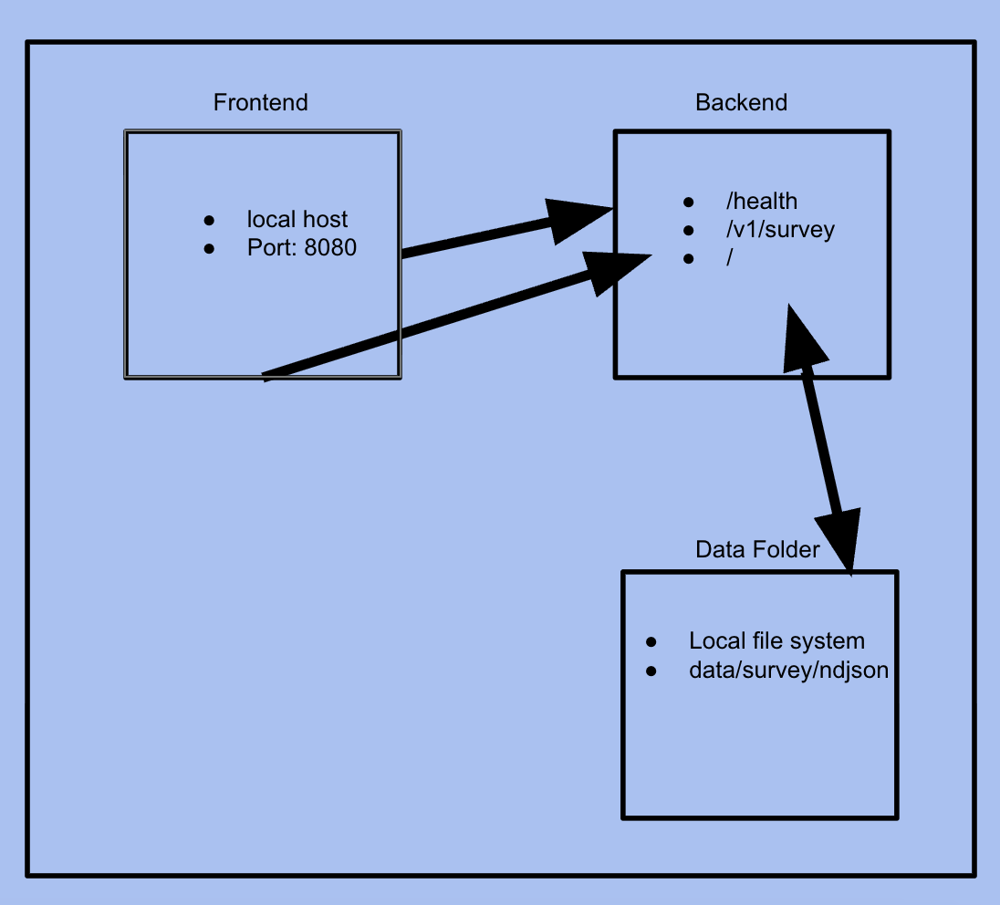
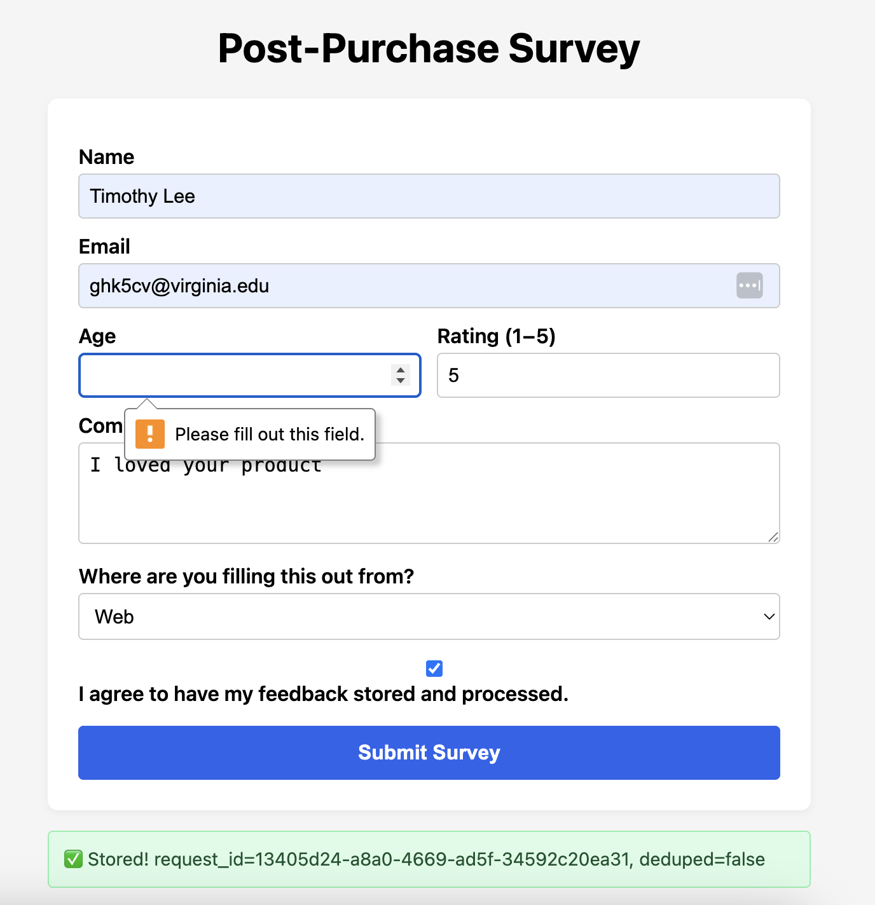
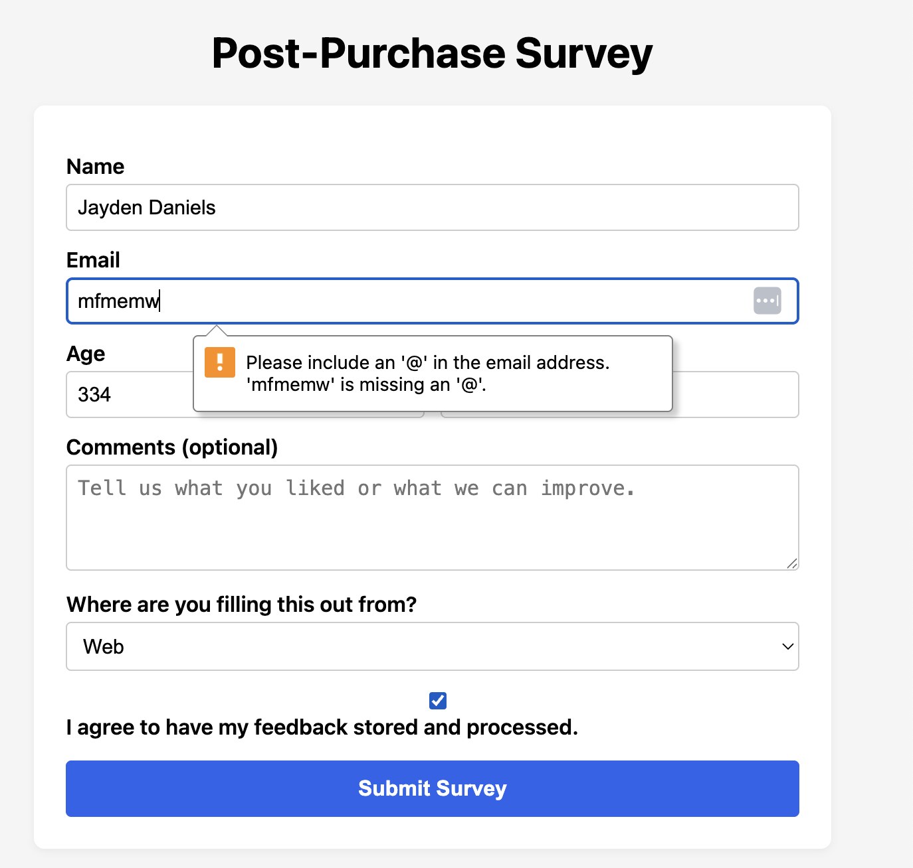
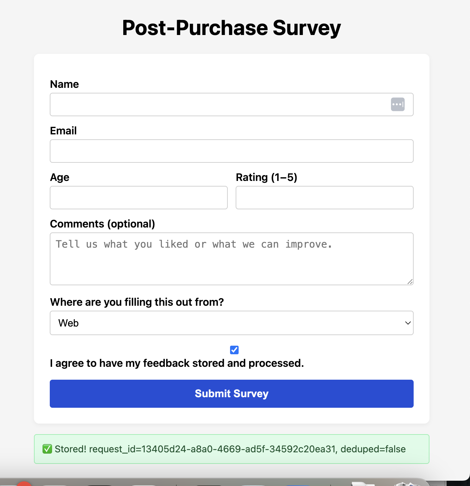

# Survey Intake API — Systems Final Project

## 1) Executive Summary

Problem: This website solves the problem for someone who is selling a product online who wants to know customer satistfaction. I personally sell products online so this app would help survey my customers. 

Solution: This website surveys the customer after they have made a purchase. It asks for their name, email, age, satistfaction from 1-5,  any other comments, and where they are filling the form out from. The website is useful because it has a lightweight backend that validates the user input's, protects private user data, and stores survey submissions in a structured format, making it easy to analyze for the seller. The seller can collect data on customer satistfaction and demographics to see trends and obtain user feedback.

## 2) System Overview

Course Concept(s): 

I used a Flask JSON POST endpoint, pydantic v1 model validation, append-only NDJSON storage, and logging and hashing for privacy. All these things are from Case Study 4. 

Architecture Diagram:

### Data Model Stored

| Field | Stored As | Notes |
|-------|-----------|-------|
| email | SHA-256 hash | never stored raw |
| age | SHA-256 hash | protects identity |
| name, rating, comments | kept readable | useful for analysis |
| submission_id | deduping key | avoids duplicate writes |
| received_at | UTC timestamp | for temporal analysis |

| Field |Stored As| Comments |
| ----- | --------| -------- |
| `email`| SHA-256 hash| Never stored raw |
| `age`| SHA-256 hash | Protects identity|
| `name` | plain text | Needed for feedback |
| `rating` | int | 1–5 |
| `comments` | optional string | Up to 1000 chars |
| `source` | enum | `web`, `mobile`, `other` |
| `submission_id` | idempotency key | Prevents duplicates |
| `received_at`| UTC ISO timestamp | For analytics |

Licensed w/ MIT License

## 3) How to Run 

DOCKER
# build
docker build -t survey-api .

# run
docker run -it -p 8080:8080 survey-api

# health check
curl http://localhost:8080/health

## 4) Design Decisions
Why these concepts?
I chose concepts from Case 4 because it gave us an easy  template for building JSON APIs using Flask, Pydantic, and NDJSON. This setup made it easy to understand, quick to build, and it worked well in general without needing a full database or a big frontend framework. Some alternatives I considered was an SQL database, but felt like too much for I wanted to accomplish. NDJSON did the job and was easier to add to. Another alternative was using raw python validation. But, again I skiiped this because Pydantic gives much better validation and better/easier to work with error messages.

Tradeoffs

 Using NDJSON for storage was extremely straightforward and easy, but it isn’t great for running complex queries. Keeping the whole Flask app in a single file made the project lightweight and easy to follow, but it wouldn’t scale well if the app needed to grow on a larger scale. Finally, embedding the frontend directly inside Flask avoided any CORS problems, but though it made the code a bit less modular.

 Security/Privacy
 
- No raw PII is ever written to disk 
- Email/age inputs are hashed with SHA-256 
- Pydantic enforces strict types, ranges, and validation
- Rejects invalid submissions with clear JSON error messages
- App asks for user consent before storing a survey

Ops
- One line command starts up app (./run.sh or Docker run
- submission_id prevents duplicates
-Logs stored in NDJSON which makes it easy to look through or load into Pandas
-Code is structured into src/app.py, src/models.py, and src/storage.py

## 5) Results and Evaluation

Here are some tests I ran on my app:

The first test I ran was where I didn't input an age. This outputted a error message seen in the image below...

The second test I ran was where I inputted an email with incorrect formatting. This outputted a error message seen in the image below...

The third test I ran was where a rating that wasn't between 1-5. This outputted a error message seen in the image below...

This last image shows the app when all the conditions are met correctly...

## 6) What's Next?

If I could continue working on this project, I would add an /admin page where I can easily see and collect all survey submissions in a table. Also, I would add some code so calculate basic stats like how many surveys were submitted or the average rating. Also, I want make the survey page more mobile-friendly so it looks better on phones. Lastly, I would want to my UI UX design look better so that it looks more professional.

## 7) Links

GitHub Repo: https://github.com/timlee717/systems-final-proj/tree/main